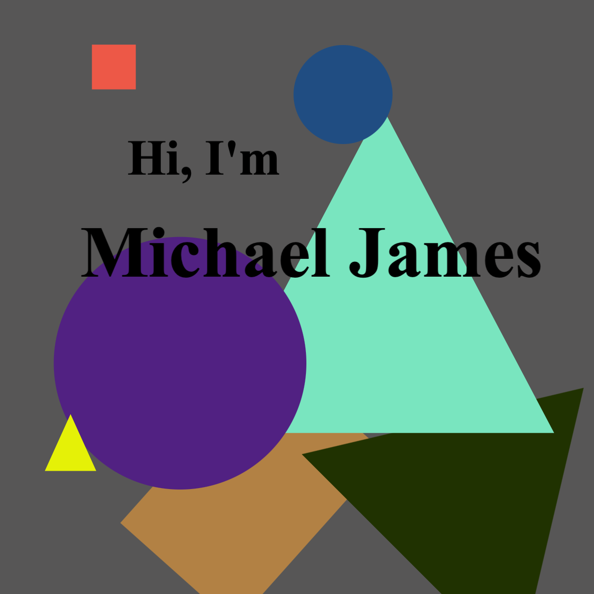

Hi, There! 👋

I'm a React developer who builds engaging web apps while seeking to solve interesting problems. I’m looking to learn from others and maybe help somebody else out. I'd like to learn more about the things that I've come across on my journey and a new and exciting should help me do just that.

## 📔 Latest Blog Posts
<!-- BLOG-POST-LIST:START -->
- [The Fundamentals of CSS, Part 1](https://michaelrjames.hashnode.dev/the-fundamentals-of-css-part-1)
- [Why I Don&#39;t Follow the No Code Movement](https://michaelrjames.hashnode.dev/why-i-dont-follow-the-no-code-movement)
- [What is a Function?](https://michaelrjames.hashnode.dev/what-is-a-function)
- [Implementing a Search Bar with a Control to Clear the Input Value using react-hook-form](https://michaelrjames.hashnode.dev/implementing-a-search-bar-with-a-control-to-clear-the-input-value-using-react-hook-form)
- [A Simple Web Development Automation Framework](https://michaelrjames.hashnode.dev/a-simple-web-development-automation-framework)
<!-- BLOG-POST-LIST:END -->

## 📌 Pinned Repositories

## 📈 Stats

## 💻 Skills

More Skills

 

 

 

 
<!---
micrjames/micrjames is a ✨ special ✨ repository because its `README.md` (this file) appears on your GitHub profile.
You can click the Preview link to take a look at your changes.
--->
