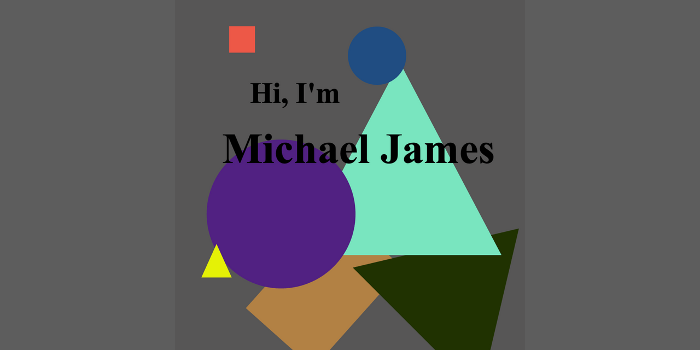

[]

- 👋 Hi, There!
- 👀 I’m interested in web development, coding, puzzles, mathematics, and any combinations of those things.
- 🌱 I’m currently learning React as well as Next. I've started dabbling in Golang as well. It's an interesting language with some similarities to C.
- 💞️ I’m looking to collaborate on anything, really. I'd like to learn more about the things that I've come across on my journey and a new and exciting should help me do just that.

<!---
micrjames/micrjames is a ✨ special ✨ repository because its `README.md` (this file) appears on your GitHub profile.
You can click the Preview link to take a look at your changes.
--->
